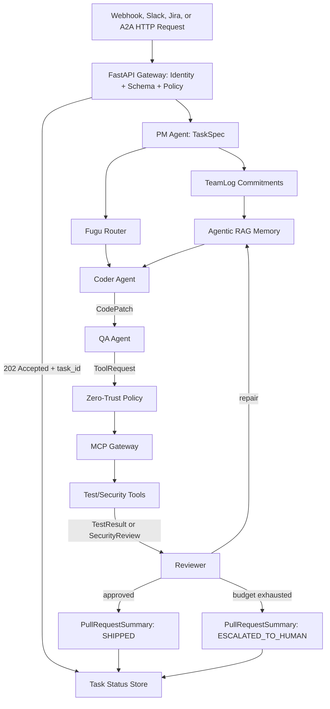

# Technical Implementation Guide

## Core Implementation Pattern

The runnable implementation is `src/enterprise_agent_team.py`. The learner-facing labs progressively build the same management architecture across `notebooks/01_hello_multi_agent.ipynb`, `notebooks/02_shared_rag_memory.ipynb`, `notebooks/03_mcp_tool_gateway.ipynb`, `notebooks/05_self_repair_loop.ipynb`, `notebooks/06_dynamic_routing.ipynb`, `notebooks/10_vibe_coding_interface.ipynb`, and `notebooks/11_enterprise_a2a_perimeter.ipynb`.

It demonstrates:

- Strict Pydantic contracts for task specs, patches, test results, review decisions, tool requests, and release summaries.
- MCP-style tool discovery and invocation through a zero-trust adapter boundary.
- Agentic RAG through shared, sensitivity-aware memory records.
- TeamLog-inspired commitments that override local agent goals.
- Fugu-style routing for worker selection and cost control.
- ChatDev-style self-repair: code -> test -> review -> repair -> ship or escalate.
- FastAPI boundary for external events, identity mapping, asynchronous orchestration, and status polling.
- Beginner-friendly governance drills for Logistics Weather, Writer, QA, and CEO scenarios that teach the same contracts with lower cognitive load.

## Architecture



## Four Definitive Technical Implementations

Instructor note: pair this technical guide with `instructor/technical_implementation_playbook.md` and `instructor/management_principle_matrix.md`. The guide explains how the system works; the instructor materials explain why each pattern matters for managing teams.

### 1. MCP: The Zero-Trust Tool Boundary

Management problem: a specialized agent should not be able to call every tool just because it knows the tool name.

Current implementation:

- `assignments/starter_code/ex4_governance_matrix_starter.py`
- `notebooks/03_mcp_tool_gateway.ipynb`
- `assignments/ex2_3_mcp_tool_governance.md`

Key production pattern:

```python
result = gateway.call(request)
assert result.success is False
assert gateway.audit_log[-1].allowed is False
```

Instructor exercise: The Rogue Agent Test. Create an external vendor with public trust, ask it to export a restricted report, and prove the gateway denies execution and records an `AuditEvent`.

Takeaway: A managed team enforces boundaries. The tool gateway is the bouncer.

### 2. Agentic RAG and Theory of Mind: Governed Shared Memory

Management problem: a coder may not see the PM's original constraint once the workflow becomes long.

Current implementation:

- `notebooks/02_shared_rag_memory.ipynb`
- `assignments/ex2_tom_memory.md`
- `assignments/starter_code/ex2_memory_system_starter.py`

Key production pattern:

```python
results = memory.search("storage", Role.CODER)
assert results[0].text == "Use PostgreSQL for persistent storage."

assert memory.search("password", Role.CODER) == []
assert len(memory.search("password", Role.SECURITY)) == 1
```

Instructor exercise: The Invisible Handoff. The PM writes a hidden storage constraint, the coder discovers it through authorized retrieval, and restricted secrets remain invisible.

Takeaway: Shared memory does not mean open memory. A good manager enforces need-to-know.

### 3. TeamLog: The Collective Commitment Engine

Management problem: local agents can satisfy their task while violating the global mission.

Current implementation:

- `src/enterprise_agent_team.py`
- `assignments/foundational_architecture_design.md`
- `assignments/ex5_capstone_virtual_software_company.md`

Key production pattern:

```python
check_teamlog_commitments(request, commitments)
```

The core implementation blocks `ToolName.CALL_EXTERNAL_API` when a visible commitment says no external network calls.

Instructor exercise: Scope Creep Prevention. The PM creates a commitment: "All code must run offline. No external API calls." The coder attempts an external API tool call. The gateway blocks the request before execution.

Takeaway: Individual tasks serve the local goal. TeamLog commitments serve the global mission.

### 4. ChatDev Self-Repair: The Bounded Quality Loop

Management problem: first drafts fail, but unbounded retry loops are unsafe and expensive.

Current implementation:

- `notebooks/05_self_repair_loop.ipynb`
- `assignments/starter_code/ex5_capstone_starter.py`
- `assignments/starter_code/ex5_capstone_solution.py`

Key production pattern:

```python
summary = run_company(issue, max_repairs=2)
assert summary.status in {"SHIPPED", "ESCALATED_TO_HUMAN"}
```

Instructor exercise: The Infinite Loop Trap. Force a patch that cannot pass, set `max_repairs=2`, and prove the system stops after 3 total attempts with `status="ESCALATED_TO_HUMAN"`.

Takeaway: Autonomy without boundaries is automated chaos. Bounded repair makes agents safe for production.

### 5. API Boundary: Governance Perimeter and Async Orchestration

Management problem: production agent teams are triggered by external events and queried by other systems. They cannot rely on local `if __name__ == "__main__"` execution.

Current implementation:

- `notebooks/08_api_boundaries_async_orchestration.ipynb`
- `assignments/ex5_capstone_virtual_software_company.md`
- `assignments/starter_code/ex5_capstone_starter.py`

Key production pattern:

```python
response = client.post("/tasks", json=payload, headers={"Authorization": "Bearer sk-internal-admin"})
assert response.status_code == 202

status = client.get(f"/tasks/{response.json()['task_id']}")
assert status.status_code == 200
```

Instructor exercise: The Customs Border. An internal admin can trigger high-priority work and receives a `task_id`; an external vendor trying the same high-priority request is rejected with `403 Forbidden`.

Takeaway: The API gateway is the governance perimeter. It turns chaotic external events into governed internal work orders.

### 6. Basic Agent Governance Labs: Familiar Agents, Production Boundaries

Management problem: beginner agents are often taught as isolated prompt wrappers. A logistics weather agent calls an API, a Writer Agent drafts text, a QA Agent clicks buttons, and a CEO prompt changes direction. That teaches prompting, not management.

Current implementation:

- `notebooks/01_hello_multi_agent.ipynb`: Governed Logistics Weather Agent builder exercise.
- `notebooks/05_self_repair_loop.ipynb`: Bounded Writer Agent builder exercise.
- `notebooks/10_vibe_coding_interface.ipynb`: Natural Language Becomes TeamLog builder exercise.
- `notebooks/11_enterprise_a2a_perimeter.ipynb`: Adversarial QA Agent builder exercise.
- `assignments/basic_agent_governance_labs.md`: formal handout and rubric.

Key production mapping:

| Familiar Agent | Governance Upgrade | Core Pattern |
| --- | --- | --- |
| Logistics Weather Agent | API key hidden in gateway, identity checked, typed weather-risk response returned | MCP-style zero-trust tool boundary |
| Writer Agent | Editor feedback is typed and repair attempts are bounded | ChatDev-style repair with escalation |
| QA Agent | External red-team payloads are classified, blocked, ticketed, and quarantined | Enterprise A2A perimeter |
| CEO Agent | Human language becomes `ProjectPlan` and `TeamCommitment`, not loose downstream prompt text | Vibe Coding with TeamLog |

Instructor exercise: The Builder Ladder. Have learners implement one familiar agent, then ask: which boundary prevents this from becoming an unsafe prompt demo?

Takeaway: Simple agents are not outside the course mission. They are the safest place to practice schemas, gateways, memory, repair, and escalation before the capstone.

## Advanced Course Expansion

The current core course teaches how to manage agent teams. The advanced extension teaches how to make individual agents skilled, production-aware, and operable.

| Module | Focus | Exercises |
| --- | --- | --- |
| 7 | Individual Agent Skill Development | Code quality assessor, test generator, security scanner, documentation generator |
| 8 | Production-Ready Agent Features | Human approval, benchmarks, cost-aware caching, long-term memory with forgetting |
| 9 | Agent Deployment & Operations | Docker, observability, secure sandbox, configuration version control |

Use these files as the extension track:

- `assignments/module7_individual_agent_skills.md`
- `assignments/module8_production_ready_agent_features.md`
- `assignments/module9_deployment_operations.md`

## Production Guidance

Use Pydantic AI for strict delegated agent calls when the output must become program input. Use CrewAI or AutoGen when the teaching goal is role clarity and conversation dynamics. Use LangGraph when the workflow needs durable state, branching, retries, and cyclic self-repair.

The local MCP gateway is intentionally a teaching adapter. In production, keep the same `ToolRequest`, `ToolResult`, and `AuditEvent` application schemas, then replace the adapter with the official MCP Python SDK server/client transport.
